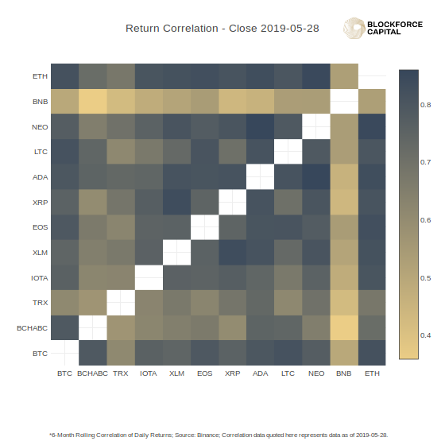

# bflabs-web
Blockforce Labs Web Tools

[blockforcelabs.com](https://blockforcelabs.com/)
A platform for showcasing BFC research and data-visualization tools

Provides API for daily coin price data from Binance.

## Data Visualization Tools 

Data for the tools is updated once daily, and calculations are done on update

Current tools:

* [Heatmap: ](https://blockforcelabs.com/api/heatmap) Today's 90-day return correlation
    * 
* [Heatmap Timeline: ](https://blockforcelabs.com/api/heatmap_timeline) Historical 90-day return correlation
    * 
* [Volatility Chart: ](https://blockforcelabs.com/api/volatility) Historical volatility of crypto-currency returns
    * 

## API
Fields returned by API:
* `n_trades`
* `price_close`
* `price_high`
* `price_low`
* `price_open`
* `timestamp`
* `volume`

Pull data by: `https://blockforcelabs.com/api/api/v1/load_daily?symbol=<symbolpair>`

Where `<symbolpair>` is a Binance symbol pair in:

- ETH-USDT
- EOS-USDT
- BTC-USDT
- TRX-USDT
- IOTA-USDT
- XLM-USDT
- XRP-USDT
- LTC-USDT
- ADA-USDT
- NEO-USDT
- BCHABC-USDT
- BNB-USDT

## File Structure

    .
    ├── database/       # psql database holding code, flask backend
    |   ├── db_init/    # database initialization
    |   ├── get_data/   # database and api connection
    |   ├── flask/      # backend for API, and data visualization       
    |   └── ...
    |
    ├── backtest/
    |     └── ...        # testing data api, and psql database
    └── ...

